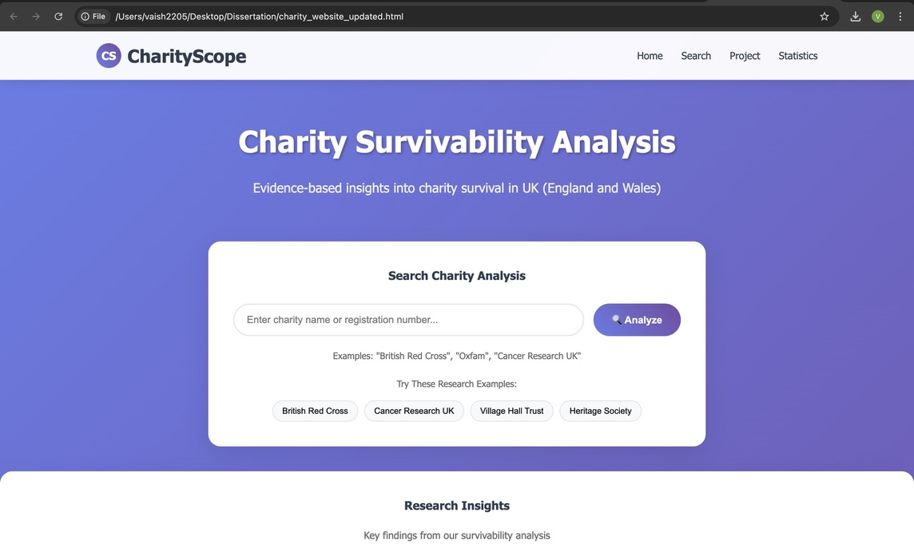
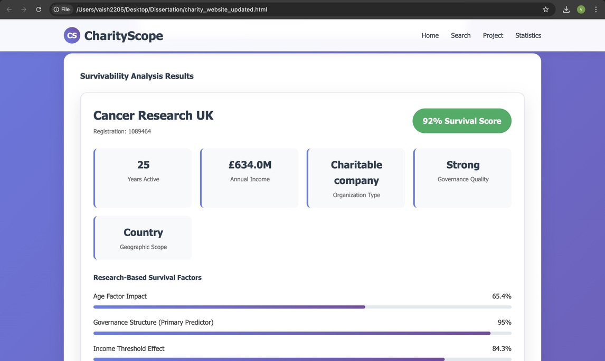

# Survivability of Charitable Organisations  
**What factors influence whether a charity survives?**

This repository contains the analysis, models, and report for a dissertation project conducted as part of the MSc Data Science and Analytics program at the University of Leeds, in collaboration with the Social Investment Business (SIB).

---

## 📌 Project Overview  
This project investigates the determinants of survival among charitable organisations in the UK. Despite their social and economic significance, many charities face sustainability challenges. Using comprehensive administrative records from the **UK Charity Commission**, this study applies advanced data science techniques to explore which factors most strongly influence whether a charity continues operating or ceases operations.  

The project contributes both **theoretical insights** into nonprofit organisational survival and **practical tools** to support evidence-based decision-making for charity leaders, funders, and policymakers.

---

## 🎯 Research Goal  
To identify organisational, financial, governance, and operational factors that influence the survival of UK charities, and to build interpretable predictive models that support the sector’s sustainability.

---

## 📂 Datasets  

### 1. UK Charity Commission Dataset (Primary)  
- **Source:** [Charity Commission for England and Wales](https://register-of-charities.charitycommission.gov.uk/en/)  
- **Coverage:** 1960s – 2024  
- **Scale:** 392,350 registered charities across 13 interconnected tables  
- **Total Records:** 8+ million  
- **Includes:**  
  - Organisational details (registration, legal structure, governing docs)  
  - Financial data (income, expenditure, reserves)  
  - Governance (trustees, policies)  
  - Operations (activities, beneficiaries, geographic scope)  
  - Compliance and regulatory history  

### 2. Companies House Dataset (Explored, Not Used)  
- **Scale:** 5.66 million UK companies  
- **Reason for Exclusion:** Lacks sector-specific governance and compliance data relevant to charities.  

---

## ❓ Research Questions  

**Main Question:**  
*What factors influence whether a charity survives?*

**Sub-questions:**  
1. What organisational demographics and structures differentiate surviving charities from those that cease operations?  
2. How do financial characteristics and resource patterns influence survival probability across charity income segments?  
3. Which governance and operational factors show the strongest association with survival outcomes?  
4. How can feature engineering extract predictive signals from administrative data to improve accuracy?  
5. Which modelling approach best balances predictive performance and interpretability for decision-making in the sector?  

---

## 🔄 Project Phases  

1. **Data Acquisition & Cleaning** – Merging 13 Charity Commission tables, handling missingness, ensuring temporal validity.  
2. **Exploratory Data Analysis (EDA)** – Trends in registrations, closures, age, income, and governance.  
3. **Feature Engineering** – Organisational demographics, financial thresholds, governance quality, temporal compliance, mission clarity.  
4. **Feature Selection** – Consensus-based using correlation, mutual information, ANOVA, and Random Forest importance.  
5. **Modelling** – Logistic regression as primary method, with robustness checks against alternative models.  
6. **Evaluation & Validation** – 5-fold cross-validation, recall-focused optimisation, sensitivity analysis.  
7. **Reporting** – Dissertation write-up, prototype dashboard for survival risk assessment.  

---

## 📊 Key Findings  

- **Top predictors of survival:**  
  - Governance quality (board size, oversight strength)  
  - Younger organisational age (short-term resilience advantage)  
  - Financial thresholds (income > £10,000)  
  - Recency of operational activity and compliance  
  - Modern legal structures (e.g., Charitable Incorporated Organisations)  

- **Model Performance (Logistic Regression):**  
  - Accuracy: **81.6%**  
  - Recall (identifying at-risk charities): **99.0%**  

- **Implications:**  
  - Challenges some aspects of lifecycle theory (younger charities can be more resilient).  
  - Governance emerges as the strongest determinant of survival.  
  - Provides a prototype **web tool** for funders/regulators to assess risk in real time.

----
## 🌐 Prototype Website Screenshots  

Below are sample screenshots of the prototype dashboard developed for this project:  

### Risk Assessment View  
  

### Charity Profile View  
  

    
----
## 👩‍💻 Author  

**Vaishnavi Patil**  
MSc Data Science and Analytics, University of Leeds  

Conducted under the **CDRC Masters Dissertation Scheme**, supervised by:  
- Dr. Luissa Cutillo (University of Leeds)  
- Christopher Davy & Alannah Keogh (Social Investment Business) 
